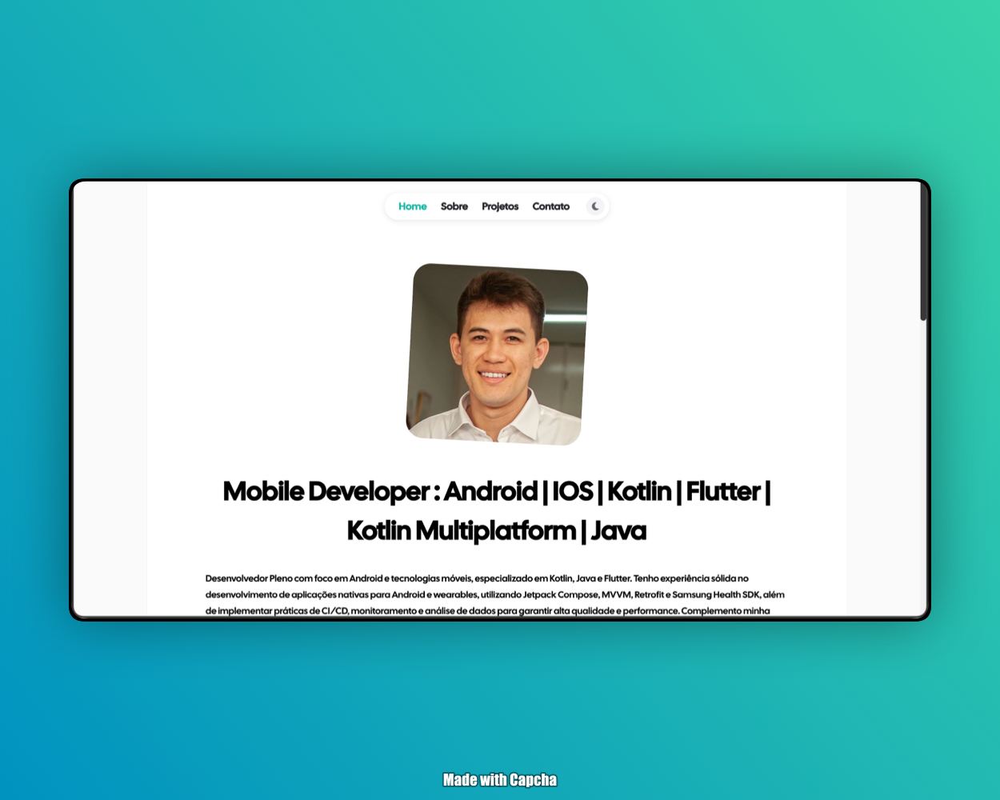

<div>


<div>

# Portfólio - Davi Gomes Florencio

Este é o projeto de portfólio pessoal de **Davi Gomes Florencio**, desenvolvido para destacar competências em desenvolvimento móvel (Android/iOS, Kotlin, Flutter) e full-stack. O projeto foi construído com foco em performance, design moderno e facilidade de manutenção.

---

## 🚀 Tecnologias e Ferramentas

O projeto utiliza o que há de mais moderno no ecossistema de desenvolvimento web:

- **[React 19](https://react.dev/):** Biblioteca principal para construção da interface de usuário, aproveitando as melhorias de performance e gerenciamento de estado da última versão.
- **[Vite 7](https://vitejs.dev/):** Ferramenta de build extremamente rápida que proporciona uma experiência de desenvolvimento ágil e builds de produção otimizados.
- **[TypeScript](https://www.typescriptlang.org/):** Adição de tipagem estática ao JavaScript, garantindo maior robustez e segurança ao código.
- **[Tailwind CSS v4](https://tailwindcss.com/blog/tailwindcss-v4-alpha):** Framework CSS utilitário configurado com a nova abordagem _CSS-first_, proporcionando estilização rápida e responsiva sem arquivos de configuração complexos.
- **[FontAwesome](https://fontawesome.com/):** Conjunto abrangente de ícones SVG para uma interface visualmente rica.
- **[React Router Dom v6](https://reactrouter.com/):** Gerenciamento de rotas para uma navegação fluida em uma Single Page Application (SPA).

---

## 🎨 Design e Estética

- **Estilo Moderno:** Uso da fonte **Cal Sans** e uma paleta de cores harmoniosa para um visual premium e profissional.
- **Dark Mode:** Suporte nativo a temas Light e Dark, com persistência no `localStorage` e transições suaves.
- **Responsividade:** Layout totalmente adaptável para dispositivos móveis, tablets e desktops.
- **Animações e Micro-interações:** Efeitos de hover e transições que tornam a navegação mais envolvente.

---

## 📂 Arquitetura e Padrões

O projeto segue padrões de mercado para garantir escalabilidade:

- **Component-Based Architecture:** Interface dividida em componentes pequenos, reutilizáveis e especializados (ex: `NavBar`, `Card`, `Footer`).
- **Data-Driven Content:** Todas as informações do portfólio (experiências, projetos, dados pessoais) são gerenciadas em um arquivo centralizado (`src/data/user.ts`), facilitando atualizações.
- **CSS-First Configuration:** Aproveita as novas capacidades do Tailwind v4 para gerenciar variáveis de tema e variantes diretamente no CSS global.

---

## 🛠️ Bibliotecas Principais

- `@fortawesome/react-fontawesome`: Integração de ícones.
- `react-ga4`: Monitoramento de métricas via Google Analytics 4.
- `vite-plugin-html`: Otimização do HTML e injeção de metadados.

---

## 🏃 Como Executar o Projeto

1.  **Clone o repositório:**
    ```bash
    git clone https://github.com/davigomesflorencio/portifolio-vite-react.git
    ```
2.  **Instale as dependências:**
    ```bash
    npm install
    ```
3.  **Inicie o servidor de desenvolvimento:**
    ```bash
    npm run dev
    ```
4.  **Crie o build de produção:**
    ```bash
    npm run build
    ```

---

## 👤 Autor

**Davi Gomes Florencio**

- [GitHub](https://github.com/davigomesflorencio)
- [LinkedIn](https://www.linkedin.com/in/davi-g-883b7a12a/)
- [Instagram](https://instagram.com/davi.kts)
